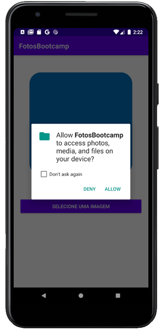

# BootcampFotos

Projeto desenvolvido durante o módulo Recursos Nativos do bootcamp Kotlin oferecido pela everis em parceria com a Digital Innovation One.

## Objetivo

Criar uma aplicação simples que peça a permissão do usuário para acessar a galeria de imagens do dispositivo e que permita o uso da imagem escolhida.

## Ferramenta(s)

Android Studio v.4.1.3 - API 23 - Android 6.0 (Marshmallow)

## Screenshot
